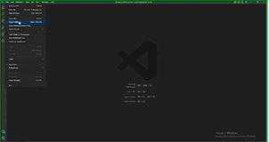

# Localhost Easy README

Its a easy way to open a connection to the localhost server, you can open using *XAMPP* or similar programs.

## Features

Describe specific features of your extension including screenshots of your extension in action. Image paths are relative to this README file.

For example if there is an image subfolder under your extension project workspace:

# How to run?
> To run the extension you can use:
* ### Ctrl+Shift+L
* ### Ctrl+Shift+P and type "*Open with Localhost*"

## Extension Settings

This extension contributes the following settings:

* #### `easy-localhost.localhost`: **Open the current folder in localhost**

### 1.0.0

Initial release

###### Probably there will not be any further changes 😘
